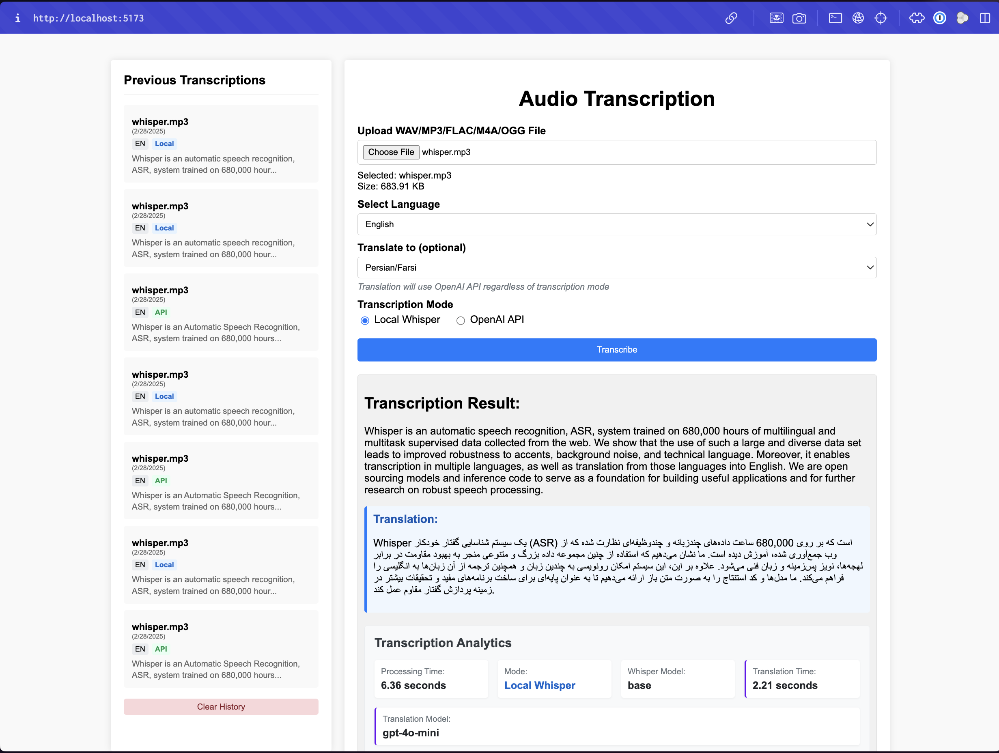

# WhisperWave 🎙️➡️📝

**AI-Powered Audio Transcription App** using OpenAI's Whisper model.

WhisperWave gives you the **best of both worlds**: process audio files locally using the built-in Whisper model OR leverage OpenAI's API for enhanced accuracy. The choice is yours for each file you upload!

## 🚀 Features
- Upload `.wav` or `.mp3` files and transcribe them into text.
- Select a language before transcription.
- Choose between local Whisper model or OpenAI API while uploading your file.
- Both transcription methods work with all supported audio formats.
- Built with **Vue + Flask + Whisper AI**.
- Fully Dockerized with **Docker Compose**.
- Uses **Whisper as a separate service** for scalability.



---

## 📌 Getting Started

### How It Works

1. **Upload your audio file** (.wav or .mp3)
2. **Select your language** (English, German, or other supported languages)
3. **Choose your transcription method**:
   - **Local Whisper**: Process directly on your machine
   - **OpenAI API**: Send to OpenAI for potentially more accurate results
4. **Click "Transcribe"** and get your text!

### 🔹 **1. Clone the Repository**
```bash
git clone https://github.com/zakariaf/whisperwave.git
cd whisperwave
```

### 🔹 **2. Configure OpenAI API Key**
Edit the `docker-compose.yml` file and replace `your_openai_api_key_here` with your actual OpenAI API key:

```yaml
whisper:
  environment:
    - OPENAI_API_KEY=your_openai_api_key_here  # Replace with your API key
```

### 🔹 **3. Run with Docker Compose**
```bash
docker-compose up --build
```

### 🔹 **4. Open in Browser**
- **Frontend**: `http://localhost:5173`
- **Backend**: `http://localhost:5000`
- **Whisper API**: `http://localhost:6000`

---

## 🛠️ Tech Stack
- **Backend**: Flask, Whisper AI (OpenAI)
- **Frontend**: Vue, Vite, Tailwind CSS
- **Containerization**: Docker, Docker Compose
- **Machine Learning**: OpenAI's Whisper for Speech-to-Text
- **Transcription Modes**: Local Whisper model or OpenAI API

---

## 📄 API Endpoints (Flask)

### 🎙️ **Transcribe Audio**
```http
POST /transcribe
```

#### **Request (Form Data)**
- `file`: `.wav` or `.mp3` file
- `language`: `en`, `de`, etc.
- `mode`: `local` or `api`

#### **Response (JSON)**
```json
{
  "transcription": "This is the transcribed text."
}
```

---

## 📄 API Endpoints (Whisper Service)
Since Whisper is a separate service, the backend **calls it internally**, but you can also call it directly.

### 🎙️ **Direct Whisper Transcription API**
```http
POST /transcribe
```

#### **Request (JSON)**
```json
{
  "file_path": "/uploads/audio.wav",
  "language": "en",
  "mode": "local"
}
```

#### **Response (JSON)**
```json
{
  "transcription": "Hello, this is a test."
}
```

---

## 🎛️ **Transcription Modes**

### **Local Whisper Model**
- Processes audio files directly on your machine using the containerized Whisper model
- No file size limitations beyond your system's resources
- Works offline without external API dependencies
- Great for larger files or when privacy is a concern

### **OpenAI API**
- Sends your audio file to OpenAI's servers for processing
- Often provides more accurate transcriptions, especially for difficult audio
- Has the following limitations:
  - Maximum file size is 25MB
  - Requires an internet connection
  - Consumes OpenAI API credits

If your file exceeds the 25MB limit for the API mode:
- The application will automatically alert you
- You can simply switch to the local mode instead
- Alternatively, you can compress your audio file or split it into smaller segments

**The choice is yours!** You can easily select which transcription mode to use while uploading your file, giving you the flexibility to choose the best option for each situation.

---

## 🔧 **How to Modify the Whisper Model?**
If you want to use a **different model (e.g., `large` instead of `base`)**, update **`whisper_service/app.py`**:

```python
model = whisper.load_model("large")
```

Then restart:
```bash
docker-compose down
docker-compose up --build
```

---

## 📌 Why is Whisper a Separate Service? 🤔

### **1️⃣ Better Scalability**
- The Whisper service runs independently, allowing **the backend and frontend to scale separately**.
- If multiple users upload audio files, Whisper can **run on its own container without blocking the backend**.

### **2️⃣ Performance Optimization**
- Whisper is a **heavy machine learning model**. Keeping it separate ensures **Flask doesn't slow down** while transcribing audio.
- This setup allows for **future GPU acceleration**, making it faster when deployed in cloud environments.

### **3️⃣ Flexibility for Multiple Models**
- You can deploy **different Whisper models** (`base`, `large`) in separate services.
- The backend can **dynamically select which model to use**, depending on the request.

### **4️⃣ Reusability for Other Applications**
- Other apps (mobile apps, other web services) can **use the Whisper API** without needing to integrate Flask.
- The Whisper service can be deployed **independently** on cloud platforms like **AWS, GCP, or DigitalOcean**.

---

## 🏗️ Future Enhancements
- Support for more audio formats (FLAC, M4A, OGG, etc.).
- Improve UI/UX with progress indicators during transcription.
- Implement real-time transcription for streaming audio.
- Add **GPU acceleration** for faster local processing.
- Implement automatic mode selection based on file size.
- Add transcription history to save previous results.
- Deploy to **cloud (AWS, GCP, DigitalOcean)** for global access.

---

## 📝 License
MIT License. Free to use and modify.

---

## 💡 **Contributing**
Want to improve **WhisperWave**? Feel free to fork the repository and submit a pull request! 🚀